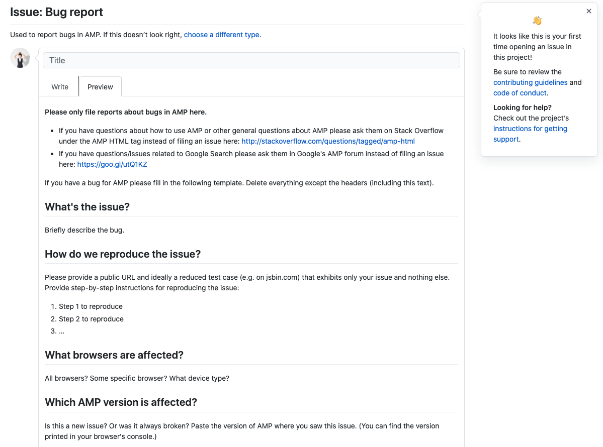
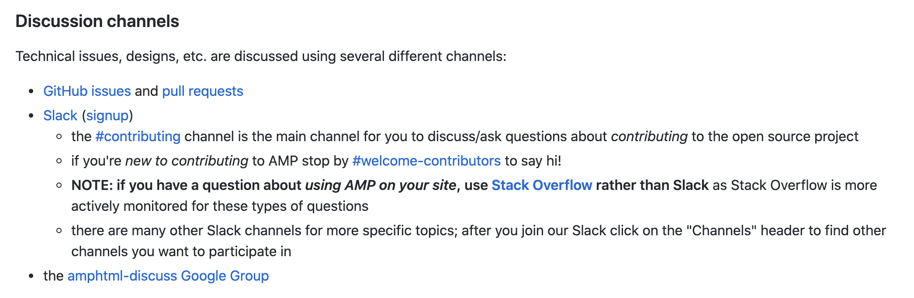
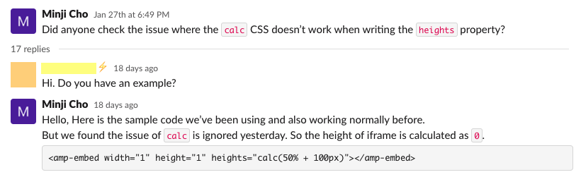
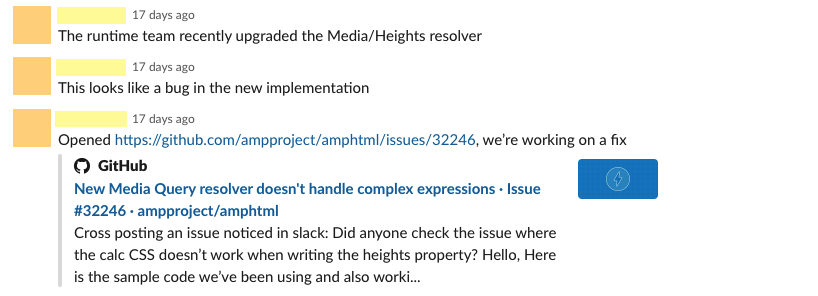
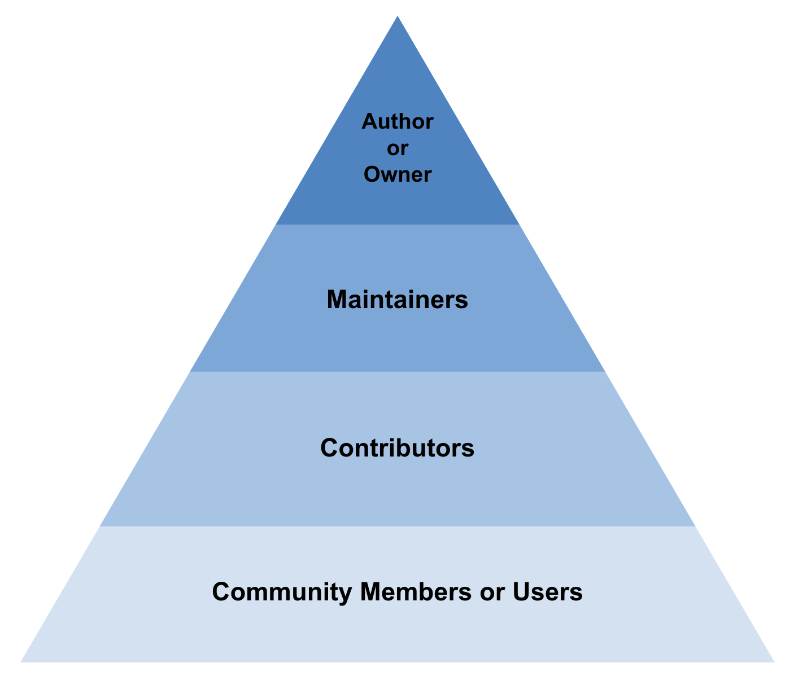
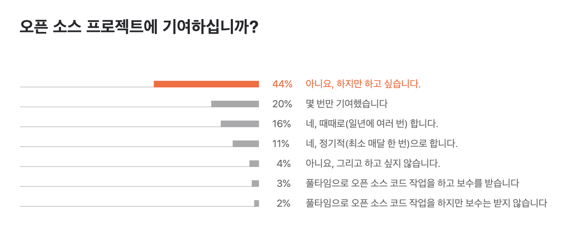

안녕하세요, 데이블 Publisher Platform 위젯 개발 담당 조민지입니다.

지난 1월, AMP([Accelerated Mobile Pages]("https://amp.dev/")) 포맷의 사이트에 송출되는 데이블 위젯 중 일부가 노출되지 않는 이슈가 있었습니다. 제보를 받고, 다방면의 디버깅을 거친 결론은,
"어제까지는 잘 되던 AMP 태그의 특정 attribute가 정상 동작하지 않는다"는 것이었습니다. (구체적인 내용은 중요하지 않으니 무시하셔도 좋습니다)

AMP 자체 버그가 의심되는 상황에서 제 의식의 흐름은 이랬습니다

1. AMP 버그일 확률이 90% 이상이더라도, 언제 해결될지 모르니 일단 대안을 마련하자
2. 누군가 이미 해당 버그를 발견해서 문의를 남겼을지도 모르니 검색을 해보자
3. 오늘 발견된 것으로 보아 최대 이틀 안에 업데이트된 내용이 있을 테니 릴리즈 노트를 확인해보자

다행히 대안은 마련했지만 완벽하지는 않은 대안이었습니다. 검색으로도, 릴리즈 노트에서도 버그와 관련된 증거는 찾지 못했습니다. (릴리즈 노트를 보고 버그의 원인을 파악하는 것은 매우 어렵다는 사실은 뒤늦게 알게 깨달았습니다)

그럼 이슈라는 걸 등록해봐야겠다 싶어 Bug report를 올리려고 했으나..

잘 정리된 이 리포트 포맷은 contributing에 대한 감이 없었던 저에겐 너무 복잡하게 느껴졌고, 버그라는 추측만 있었기에 "버그 리포트"라는 포맷에서 부담도 느껴졌습니다

그렇게 뒷걸음질 치던 중 부담이 적은 Discussion channel 목록을 발견했고, 전 Slack을 선택했습니다
AMP 그룹은 Stack Overflow를 통한 질문을 권장했지만, actively monitored라는 설명과는 달리 실제로 답변이 달린 케이스는 적었고, 혹시 답변이 달린다면 모니터링하기에는 Slack이 더 편하리라 판단했습니다

이 문서가 당연히 README 일 거라 생각했다가 뒤늦게 아님을 알게 되었습니다

간단한 샘플과 함께 짤막한 질문을 올리고 잠든 사이, AMP 그룹의 maintainer 개발자가 빠르게 버그를 확인하고 이슈를 올린 뒤, 수정 후 배포까지 해주었습니다

빠른 대응에 고맙고 다행스러웠지만, Issue로 직접 등록했다면 더 많은 경험을 하고 Contributor로 이름도 올릴 수 있었을 것이라는 개인적인 아쉬움이 남았고, 오픈소스 기여에 대해 알아보는 계기가 되었습니다.

---

## 오픈소스의 중심에서

우리는 수많은 [오픈소스](https://en.wikipedia.org/wiki/Open-source_software)를 사용합니다. (오픈소스는 대부분 소프트웨어를 말하지만, 소프트웨어에 한정된 것은 아닙니다. 다만 이 글에서 말하는 오픈소스는 오픈소스 소프트웨어를 말합니다)
말 그대로 다양한 소스 코드가 "open"되어 있고, 원하는 누구나 자유롭게 읽고, 쓰고, 수정하고, 배포할 수 있습니다
열려있는 소스들을 잘 가져다 쓰긴 하지만 그들에게 우리의 마음을 열기는 쉽지 않습니다

## 코드에 마음을 열다니요

오픈소스 소프트웨어(OSS)를 만든 사람 혹은 팀이 소스 코드를 공개하는 이유 중, 개인적으로 가장 중요하다고 생각하는 포인트는
"많은 사람과 소통하며, 내가 발견하지 못했던 부족한 부분을 보완하고, 더 안정적이고 좋은 코드로 발전시키기 위함" 입니다

그래서 오픈소스에는 "Contribution"이라는 개념이 있고, 다양한 방법을 통해 소스 코드 발전에 기여한다면 Community member 혹은 User에서 Contributor로, 소스 코드에 한 발 더 다가갈 수 있습니다. (Author, Owner이면서 동시에 Maintainer일 수도 있으나 역할의 측면에서, Community member는 기여까지는 아니더라도 활동적으로 의견을 제시한다는 점에서 User와 구분해 지칭했습니다)

2020년 초 2만 명의 개발자를 대상으로 진행한 [JetBrains의 설문조사](https://www.jetbrains.com/ko-kr/lp/devecosystem-2020/)에 따르면 오픈소스 프로젝트에 기여를 해봤거나, 하고 있는 개발자는 52%에 불과합니다

저는 이 "기여"의 과정을 코드에 마음을 여는 것이라고 표현했습니다. 저 역시 아직 마음을 열어본 경험이 없기 때문에 아래부터는 리서치와 여러 가이드를 참고해서 작성했습니다

## 기여는 아무나 하나요

위 설문조사에 따르면 아직 기여를 해보지는 않았지만 하고 싶다는 답변은 44%입니다. 하고 싶지만 하지 않은, 하지 못한 이유가 무엇일까요?

44%의 개발자 중 다수가 저와 비슷한 생각을 하고 있지는 않을까 생각해 봤습니다

AMP 버그를 경험하기 전까지는 오픈소스 기여라는 개념이 낯설었을뿐더러, 개념을 처음 알게 되었을 때에도 이런 생각을 했습니다,
'아유 전 주니어인걸요, 제가 무슨 기여를...'

AMP 케이스처럼 우연히, 아직 발견되지 않은 버그를 먼저 발견할 수 있습니다. 하지만 그건 아주 드문 케이스라고 생각합니다

그럼 어떻게 기여를 할 수 있을까요? Github에서는 [기여의 넓은 범위](https://opensource.guide/how-to-contribute/#what-it-means-to-contribute)를 알려줍니다.

우리는 이 가이드에서 꼭 코드를 제공해야만 기여하는 것은 아니라는 사실을 알 수 있습니다. 2016년 조사 결과, 기여의 28%가 오타 수정, 포맷 수정, 번역과 같은 documentation 영역에서 이루어졌다고 하니, 기여의 부담을 조금은 덜 수 있지 않을까요?

이미 오픈소스에 기여해본 경험이 있다면, [firstpr.me](https://firstpr.me/)에서 내 첫 번째 PR을 찾아볼 수 있습니다

## 그래서 뭐부터 하면 되죠?

### 프로젝트 선정 🔭

수많은 오픈소스 중 어떤 프로젝트에 기여를 할지 모르겠다면, 이미 자주 쓰고 있거나 관심이 있었던 프로젝트부터 시작하는 것이 당연히 좋습니다. 다만, 해당 프로젝트가 기여하기에 적합한지는 확인이 필요합니다. [Github에서 제공하는 체크리스트](https://opensource.guide/how-to-contribute/#a-checklist-before-you-contribute)를 먼저 확인해주세요

체크리스트에는 나와 있지 않은 한 가지 추가적인 팁은, 이미 닫힌 이슈나 PR에 대한 프로젝트 관리자의 대응 방식을 확인하는 것입니다. 기여자의 의견이 반영되지 않았더라도 타당한 이유와 함께 감사를 표한, 기여의 소중함을 아는 프로젝트라면 기여하기에 적합하다고 볼 수 있습니다

이제 막 관심을 갖는 단계라 프로젝트 선정이 어렵다면, Github Issues에서 랜덤하게 찾아보는 방법이 있습니다.
`good first bug`, `good first contribution`, `first-timers-only`, `good first issue` 와 같은 [FIRST_PR_LABELS](https://github.com/librariesio/libraries.io/blob/6afea1a3354aef4672d9b3a9fc4cc308d60020c8/app/models/github_issue.rb#L8-L14)로 필터링을 해보면, contributor에게 기회를 제공하는 [수많은 오픈소스가 검색](https://github.com/issues?utf8=%E2%9C%93&q=is%3Aopen+is%3Aissue+label%3Afirst-timers-only)됩니다

너무 많은 결과를 걸러 보기가 힘들다면, 태그 필터링으로 검색할 수 있는 [Up For Grabs](https://up-for-grabs.net/)를 활용할 수도 있습니다

아직 assign 되지 않은 이슈 중 마음에 드는 프로젝트를 찾았다면 참여 의사를 밝히시면 됩니다. 고민하는 사이 다른 누군가가 assign 될 수도 있으니 빠르게 겟하세요!

### 기여할 포인트 찾기 🔍

오픈소스에는 언제나 "신선한 시각"이 필요합니다. 이미 너무 많이 쓰이는 소스 코드라고 해도, 다수에게 익숙해져 있기 때문에 발견하지 못하는 영역이 분명 있을 수 있습니다

진입장벽이 가장 낮은 documentation부터 시작해도 좋습니다. README 가이드를 따라가며, 설명이 부족하거나 이해가 안 되는 부분에 대안을 제시하거나, 링크가 깨지는 것을 제보할 수도 있습니다

또 한 가지 방법은, 프로젝트에서 `todo`를 검색해보는 것입니다. ([AMP 예시](https://github.com/ampproject/amphtml/search?p=2&q=todo)) 언젠가 하려고 todo로 남겨두었다가 잊힌 코드를 찾아내 업데이트를 제안하는 것 역시 좋은 기여 포인트가 될 수 있습니다

기여할 포인트를 찾았다면 이미 누군가가 제시한 의견이거나, 작업 중이지는 않은 지 확인해보는 것이 좋습니다. 적당한 키워드로 프로젝트의 Issue, Stack Overflow에서 빠르게 확인해주세요

가장 중요한 것은, 기여를 위한 과도한 리소스 투입은 오히려 역효과가 날 수 있다는 사실입니다. 이미 자주 쓰고 있거나, 관심 있는 프로젝트 선정을 권장하는 이유가 바로 여기에 있습니다. 목표를 위한 목표를 세우는 과정에서 흥미를 잃지 않으셨으면 합니다

### 의견 제시 💬

포인트를 찾았다면 의견을 제시할 시간이지만, 그 전에 먼저 확인할 것이 있습니다

CONTRIBUTING.md ([AMP 예시](https://github.com/ampproject/amphtml/blob/master/CONTRIBUTING.md)) 문서를 찾아보세요. 어떤 기여를, 어떻게 할 수 있는지 자세한 가이드가 작성되어 있을 것입니다 (제가 AMP 버그 케이스에서 뒷걸음질로 발견한 Discussion channels가 정리된 문서 역시 README.md가 아닌 이 문서였습니다)

모든 오픈소스에 기여에 대한 가이드가 있는 것은 아닙니다. 하지만 Github에서 [가이드 제작을 권장](https://docs.github.com/en/github/building-a-strong-community/setting-guidelines-for-repository-contributors)하고 있으니, 가이드가 없는 프로젝트라면 CONTRIBUTING.md 제작을 제안하는 것부터 기여 포인트로 잡을 수도 있습니다

가이드를 확인했다면, 그에 따라 의견을 제시해주세요. 이슈 템플릿이 제공된다면 템플릿대로, 템플릿이 제공되지 않거나 적당한 카테고리가 없다면 blank issue를 생성하면 됩니다. 이슈가 대화와 논의 정도라면 PR은 실제 솔루션을 제안하는 목적이다 보니, PR 전용의 더 디테일한 가이드가 있을 수도 있습니다

실제 프로젝트에 바로 기여하는 것이 부담된다면, Github에서 제공하는 [first contribution 가이드](https://github.com/firstcontributions/first-contributions/blob/master/translations/README.ko.md)로 연습해볼 수 있습니다

### 실망하지 않기☝🏻

얼만큼의 리소스를 투입했던, 의견을 제시했다면 누군가의 피드백을 기다리고, 제안이 받아들여지길 기대하게 되고, Contributing의 가장 매력적인 결과물은 당연히 "contributor로 이름을 올리는 것"일 수 있습니다

하지만 기여가 받아들여지는 것에 너무 큰 의미를 두지는 않는 것이 좋습니다. 받아들여지지 않았거나 피드백을 받아 수정하는 과정에서 지치거나, 아예 답변이 오지 않을 수도 있습니다. 좌절하거나 실망하지 않는 것이 또 다른 기여를 계속 이어갈 수 있는 가장 중요한 포인트입니다

프로젝트를 물색하고, 기여할 포인트를 찾고, 의견을 제시하는 이전 과정에서 이미 우리의 커뮤니케이션 능력과 문서화 능력, 프로그래밍 실력은 향상되었습니다

---

누구나 반드시 contribution을 해야 한다는 이야기가 아닙니다

오픈소스 기여의 방법을 깊게 알아보면서 저 혼자, 저도 모르는 사이 세워둔 장벽을 깨닫고, 하나둘 낮춰가다 보니 생각보다 쉽고, 생각보다 기회도 많고, 무엇보다 "재미"를 느꼈던 경험을 나누고 싶었습니다

세상엔 많은 오픈소스가 있고, 우리의 contributing을 기다리고 있습니다 🙌🏻

---

## 참고 자료

- [Github Open Source Guides](https://opensource.guide/)
- [Naver Open Source Guide](https://naver.github.io/OpenSourceGuide/book/)
- [Complete Guide to Open Source - How to Contribute](https://www.youtube.com/watch?v=yzeVMecydCE)
- [Contributing to Open Source for the first time](https://www.youtube.com/watch?v=c6b6B9oN4Vg)
